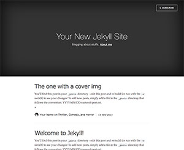
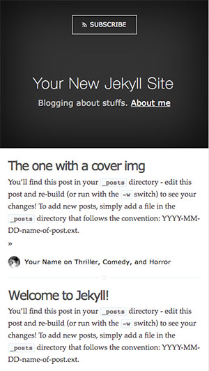
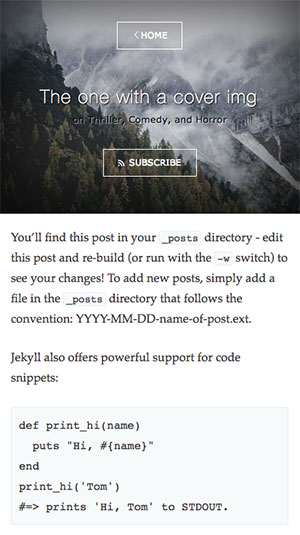

# Casper Jekyll High-Perf

> This is a high-performance port of Ghost's default theme [Casper](https://github.com/tryghost/casper) for Jekyll. 
Feel free to fork, change, modify and re-use it. Goal was to get the page load under ~14Kb after gzip. Lemme know how I did.

## Installation

    git clone https://github.com/spacerockzero/casper-jekyll-high-perf.git
    cd casper-jekyll-high-perf
    gem install jekyll
    gem install pygments.rb
    npm install

## How to use it

Build page and start local web server

    npm run dev

Build page into `_site` folder

    npm run build

## casper-jekyll-high-perf theme includes

* Pagination
* Rss
* Google Analytics Tracking code ?
* Code Syntax Highlight
* Author's profile with picture
* Disqus comments

## Screenshots

## Thanks

Based on [Kasper theme](http://github.com/rosario/kasper), by Rosario. Most of the work has been already done by the Ghost team and Rosario. I've just made it more high-performance.

## Copyright & License

Copyright (C) 2013 Ghost Foundation - Released under the MIT License.

Permission is hereby granted, free of charge, to any person obtaining a copy of this software and associated documentation files (the "Software"), to deal in the Software without restriction, including without limitation the rights to use, copy, modify, merge, publish, distribute, sublicense, and/or sell copies of the Software, and to permit persons to whom the Software is furnished to do so, subject to the following conditions:

The above copyright notice and this permission notice shall be included in all copies or substantial portions of the Software.

THE SOFTWARE IS PROVIDED "AS IS", WITHOUT WARRANTY OF ANY KIND, EXPRESS OR IMPLIED, INCLUDING BUT NOT LIMITED TO THE WARRANTIES OF MERCHANTABILITY, FITNESS FOR A PARTICULAR PURPOSE AND
NONINFRINGEMENT. IN NO EVENT SHALL THE AUTHORS OR COPYRIGHT HOLDERS BE LIABLE FOR ANY CLAIM, DAMAGES OR OTHER LIABILITY, WHETHER IN AN ACTION OF CONTRACT, TORT OR OTHERWISE, ARISING FROM, OUT OF OR IN CONNECTION WITH THE SOFTWARE OR THE USE OR OTHER DEALINGS IN THE SOFTWARE.
